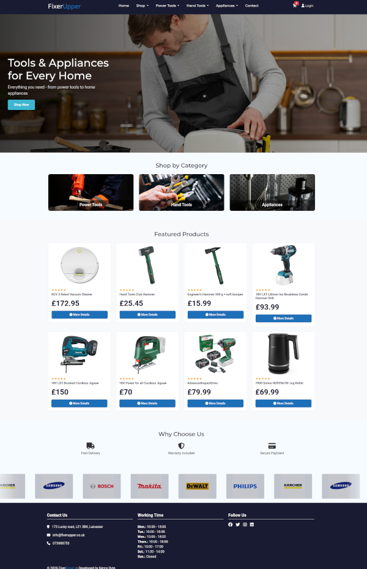
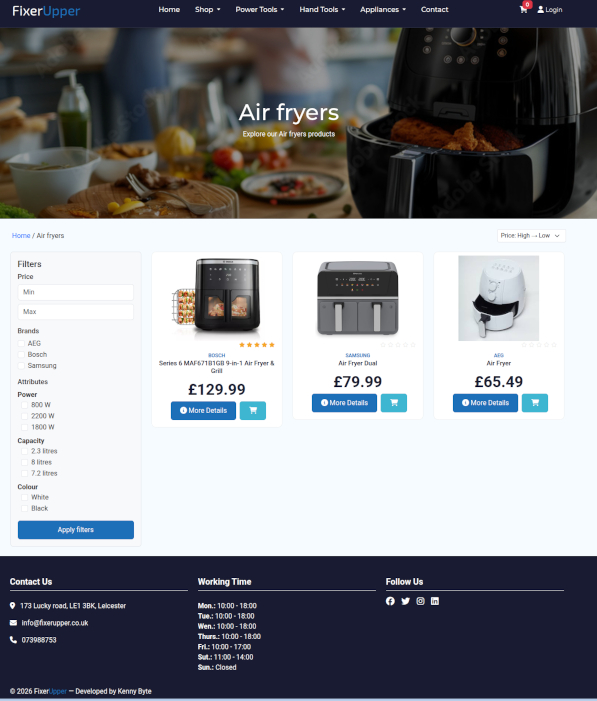
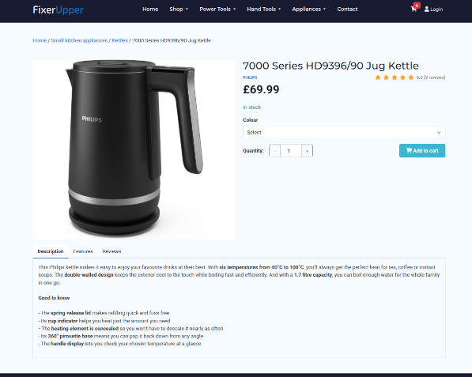
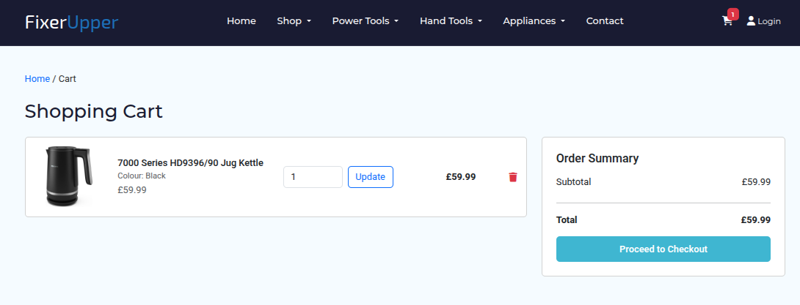
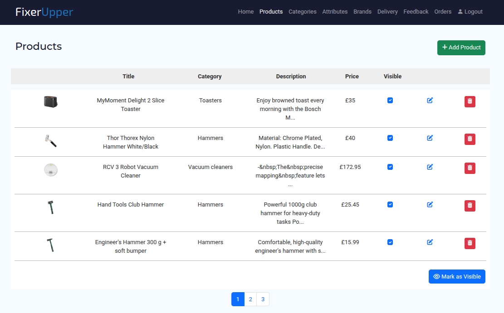

# FixerUpper E-Commerce Prototype

## Overview

FixerUpper E-Commerce Prototype is a secure database-driven online shopping system developed using PHP, MySQL, JavaScript, CSS, and Bootstrap.

The project was created as a prototype for a hardware appliance retailer to demonstrate how an online sales platform could support both customer purchases and administrative business operations.

The system provides customer-facing functionality for browsing products, managing a shopping cart, placing orders, and submitting reviews, alongside a comprehensive administration area for managing products, categories, attributes, brands, orders, and customer feedback.

---

## Key Features

### Customer Features

* Product catalogue with categories and filtering
* Product variations and attributes
* Shopping cart functionality
* Customer registration and login
* Checkout and order confirmation
* Order history
* Product reviews and ratings

### Administrative Features

* Product management
* Rich-text product description editor using TinyMCE
* Category management
* Brand management
* Attribute and variation management
* Order management
* Review moderation
* Delivery and payment option management

### Security Features

* Password hashing using bcrypt
* SQL Injection protection using prepared statements
* Session hijacking protection
* Cross-Site Scripting (XSS) protection
* CSRF protection
* Security headers
* Session timeout controls
* Input validation and sanitisation

---

## Technology Stack

### Front End

* HTML5
* CSS3
* Bootstrap
* JavaScript
* jQuery

### Back End

* PHP

### Database

* MySQL

---

## Database Design

The database was designed to support:

* Product variations
* Product attributes
* Product reviews
* Customer accounts
* Order management
* Administrative functionality

The structure was designed to be scalable and easily extendable for future development.

---

## Project Structure

```text
admin/       Administrative functionality
includes/    Shared functions and configuration
css/         Stylesheets
js/          JavaScript files
img/         Images and assets

index.php    Home page
product.php  Product details
cart.php     Shopping cart
checkout.php Checkout process
auth.php     Authentication
```

---

## Security Implementation

The application was developed with security as a core requirement.

Implemented protections include:

* Password hashing using PHP password_hash()
* Prepared statements for all database queries
* Session regeneration after authentication
* Secure session handling and inactivity timeout
* Output escaping and rich-text sanitisation
* CSRF token validation
* Content Security Policy (CSP)
* Additional security headers

---

## Future Improvements

* User administration and role management
* Login rate limiting
* Automated testing
* Inventory synchronisation when cancelled orders are processed
* Variation-specific stock management
* HTTPS deployment
* Integration with a production payment gateway

---

## Screenshots

### Home Page



### Category Page



### Product Page



### Shopping Cart



### Admin Dashboard



